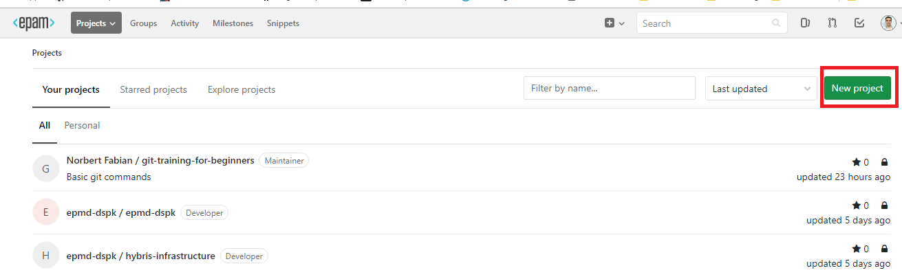
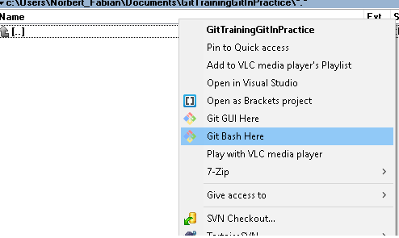
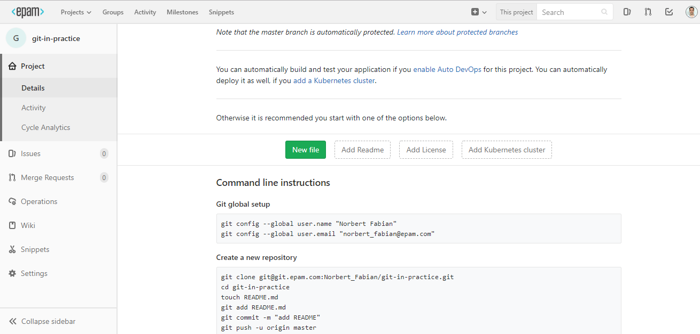
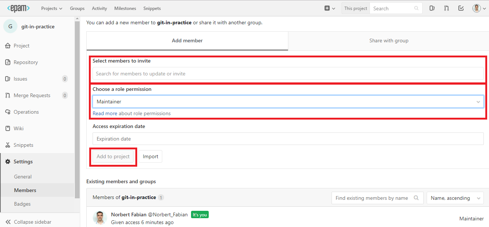

How to create a new repository:

1. Open the [gitbud.epam.com](https://gitbud.epam.com)

2. Click on **New Project** Button

3. Give **Project name**
4. Set the Visiblity Level to **Private**
5. Click on **Create project** Button

6. Open **Git Bash** from selected folder with Total Commander

7. Go back to the **gitbud**
8. Follow the instructions (**Git global setup** and **Create a new repository**) and write the following codes into the console (copy + paste)

10. Click on **Settings**
11. Click on **Member**
12. Add your Mentor as a **Maintainer** in your repository
13. Add your Curator (TDB) as a **Reporter** in your repository

