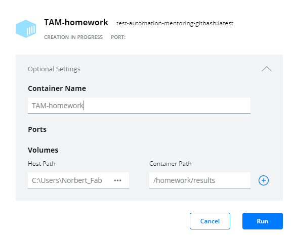
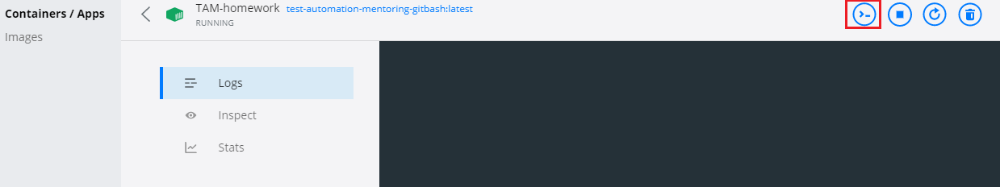

###### Test Automation Mentoring Program 2021

## Module 12 - Bash scripting- and SQL basics

##### Homework
_**Precondition:**_  
Development environment should be set up since homework should be created in a (dockerized) linux environment.  
You can find setup instructions [here](materials.md#environment-setup).

_**Start container:**_

1. Copy **sql**, **results** folder and Dockerfile from [12-bash-scripting-and-sql-basics](https://gitbud.epam.com/imre_papai/tam-2021/-/tree/docker/12-bash-scripting-and-sql-basics) to your TAM repository
2. Open your bash console(GitBash or WSL2)
3. Navigate to: _tam-2021\12-bash-scripting-and-sql-basics_
4. Build image: ```docker build --tag test-automation-mentoring .```

   - **If you faced with the following issue:**<br/>
```failed to solve with frontend dockerfile.v0: failed to build LLB: failed to load cache key: rpc error: code = Unknown desc = error getting credentials - err: exit status 1, out:```

    - Write the following command in console:<br/>
    ```export DOCKER_BUILDKIT=0  export COMPOSE_DOCKER_CLI_BUILD=0 ```
5. Run image: 
    * **Git bash:** ```winpty docker run -it -v /$(pwd)/results:/homework/results test-automation-mentoring``` 
    * **WSL2:** ```docker run -it -v $(pwd)/results:/homework/results test-automation-mentoring```
    * **Desktop UI:** 

        - find **test-automation-mentoring** image at **Images on Disk** window
        - click on **RUN** button and fill the form:<br/>
 <br/>
**Name:** TAM-homework<br/>
**Volumes - Host path:** Your_path_to_the_tam\tam-2021\12-bash-scripting-and-sql-basics\results<br/>
**Volumes - Container path:**/homework/results<br/>
        - click on TAM-homework container
        - click on CLI button at top right<br/>
<br/>

_**Task:**_
1. Go to the `homework` folder and create `tam2021` subfolder
2. Move `mentees.sql` (located in the `homework` folder) to the newly created `tam2021` folder
3. Go to `tam2021` folder and import `mentees.sql` to a database called `tam2021.db`  
  For details see the bottom of http://www.tutorialspoint.com/sqlite/sqlite_create_database.htm (_"You can perform restoration..."_)

4. Create a file under `tam2021`, its name should be `homework.sh` (this will be your executable shell script)
5. Edit `homework.sh` script file (e.g. with _nano_ editor):
  1. First line should be the shebang/hashbang (`#!/bin/sh`)
  2. Query the _first-_ and _lastname_ of mentees (from `mentees` table) and save the result to `out1.txt`

6. Extend `homework.sh` with the followings:
  1. Update the record that contains your name with your _email address_ (do not delete and re-create the record, just update)
  2. Query the updated record only and save the result to `out2.txt`

7. Extend `homework.sh` with the followings:
  1. Delete the record that contains your name
  2. Query the list of remaining mentees and save the result to `out3.txt`

8. Extend `homework.sh` with the followings:
  1. Insert a record which contains your name
  2. Query all the mentees and save the result to `out4.txt`

9. Append the number of mentees to the end of the `out1.txt`  
  **Do not use an SQL query for headcount retrieval!**

10. Copy all files from `tam2021` folder to `homework/results` folder

Push your results to your Git remote

_**NOTE:**_
- You can restore the database if you remove the generated `tam2021.db` file and repeat step #3 (_"Go to `tam2021` folder and import..."_)
- To execute your script, type `sh homework.sh` and hit enter (make sure that you are in the right folder)


##### Evaluation Criteria
* 0 point: No homework provided
* 3 points: Tasks #1 - #6 are implemented
* 5 points: All the steps are implemented
